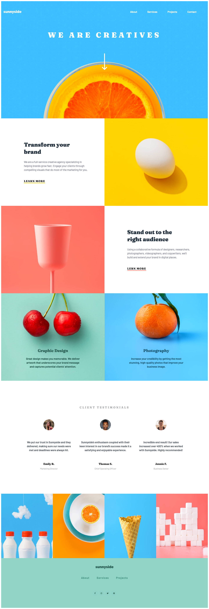
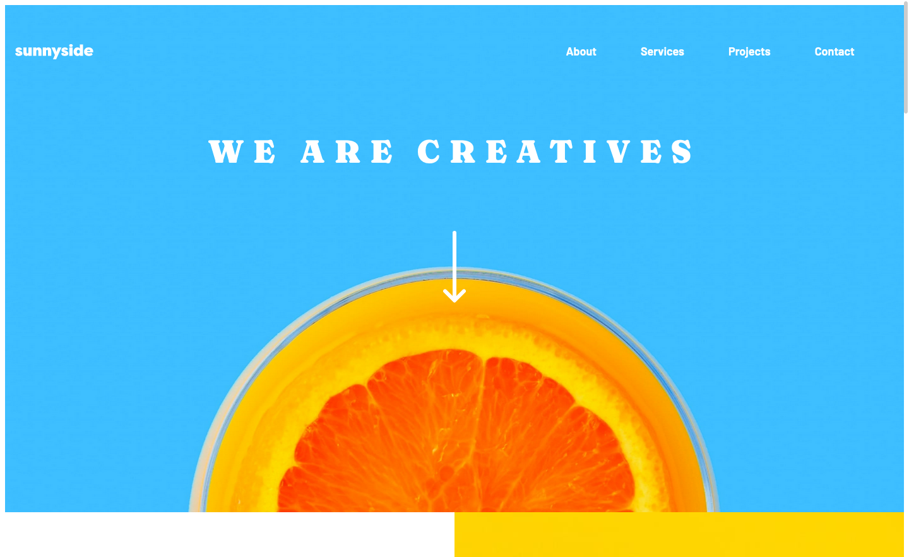
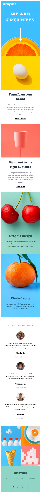
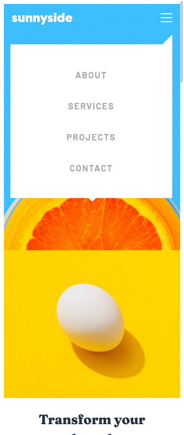

# Frontend Mentor - Sunnyside agency landing page solution

This is a solution to the [Sunnyside agency landing page challenge on Frontend Mentor](https://www.frontendmentor.io/challenges/sunnyside-agency-landing-page-7yVs3B6ef). Frontend Mentor challenges help you improve your coding skills by building realistic projects.

## Table of contents

- [Overview](#overview)
  - [The challenge](#the-challenge)
  - [Screenshot](#screenshot)
  - [Links](#links)
- [My process](#my-process)
  - [Built with](#built-with)
  - [What I learned](#what-i-learned)
  - [Continued development](#continued-development)
  - [Useful resources](#useful-resources)
- [Author](#author)
- [Acknowledgments](#acknowledgments)

## Overview

### The challenge

Users should be able to:

- View the optimal layout for the site depending on their device's screen size
- See hover states for all interactive elements on the page

### Screenshot






### Links

- Solution URL: [Portfolio](https://gelatodigital.com/#portfolio)
- Live Site URL: [rodrigos-sunnyside-agency-landing-page.netlify.app/](https://rodrigos-sunnyside-agency-landing-page.netlify.app/)

## My process

### Built with

- Semantic HTML5 markup
- CSS custom properties
- Flexbox
- CSS Grid
- Mobile-first workflow

### What I learned

This would be easier to build using scss, it would save a lot of repetition and the css would be easier to read

It would also make it easier on the index page. I hate doing double updates and using mob/desk properties to display a different version of the same picture
```html
    <div class="bot-pics">
      
      
    </div>
```

The position fixed helps with the mobile menu
```css
.topnav #myLinks {
    display: none;
    position: fixed;
}
```

Simple function 
```js
function myFunction() {
    var x = document.getElementById("myLinks");
    if (x.style.display === "block") {
      x.style.display = "none";
    } else {
      x.style.display = "block";
    }
  }
```
Connects with html, and the href makes the function work in a way
```html
<a href="javascript:void(0);" class="icon" onclick="myFunction()">
```
But it doesn't make the menu disappear when I click outside of it, which I would like better than the current behaviour

### Continued development

Sass and scss is obviously the way to go from here

### Useful resources

- [Hamburguer Menu](https://www.w3schools.com/howto/howto_js_mobile_navbar.asp) - This is the bare bones version of what the challenge is aiming at

- [Full Screen Screenshot](https://support.mozilla.org/en-US/kb/take-screenshots-firefox) - This is good for showing the entire design, not just the tip of hte page

## Author

- Website - [Rodrigo Barbosa](https://www.gelatodigital.com)
- Frontend Mentor - [@Rod-Barbosa](https://www.frontendmentor.io/profile/Rod-Barbosa)

## Acknowledgments

Thank you for my buddy Steven for reminding me how useful the screenshot tool on firefox is. I'll probably switch to developing in firefox


